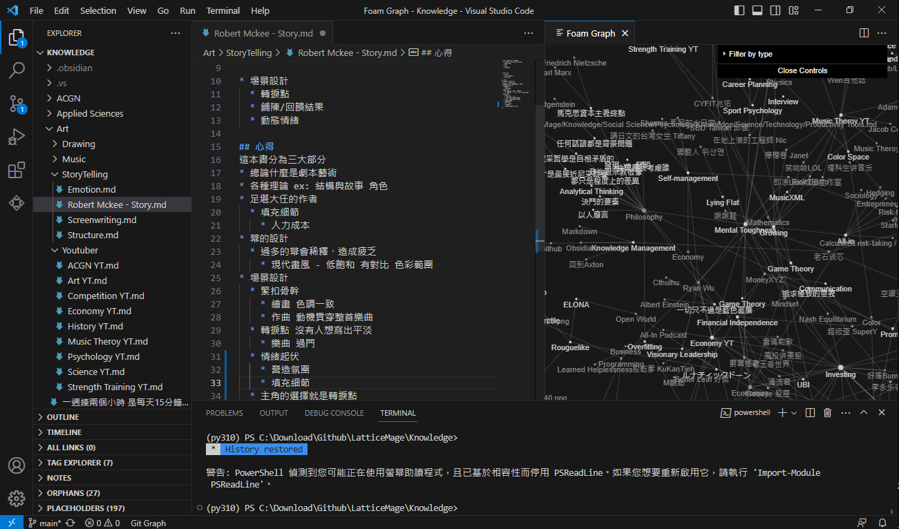
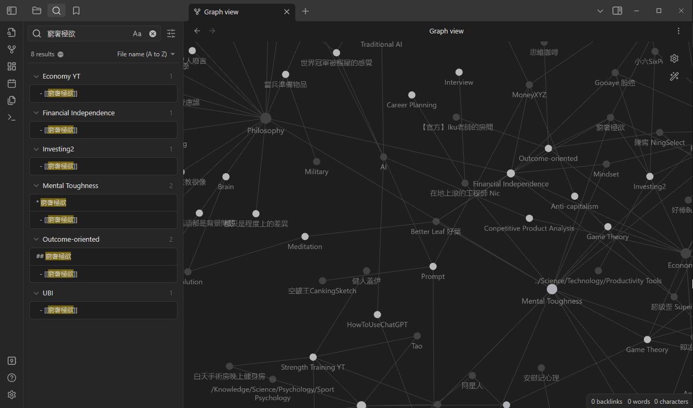
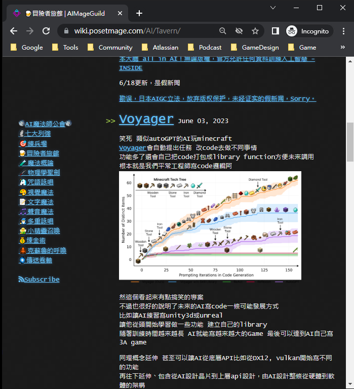
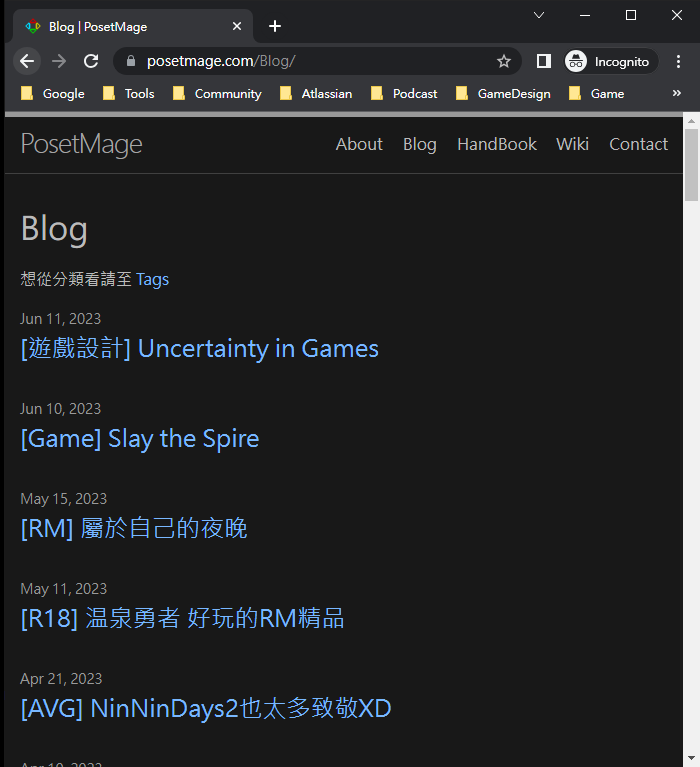
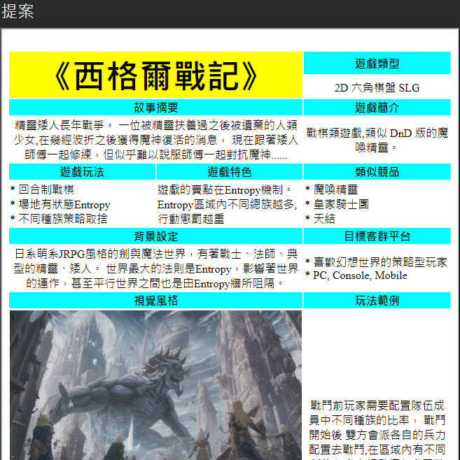
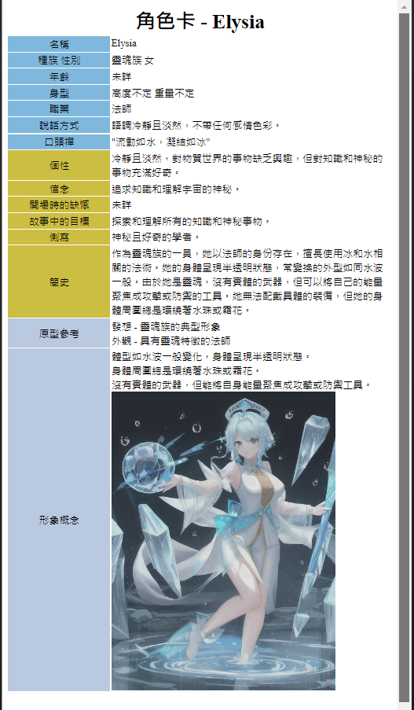
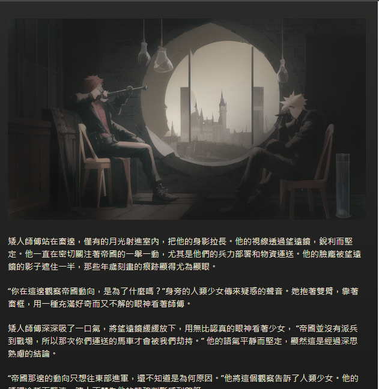
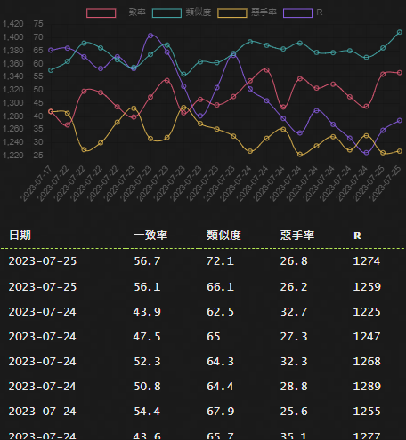
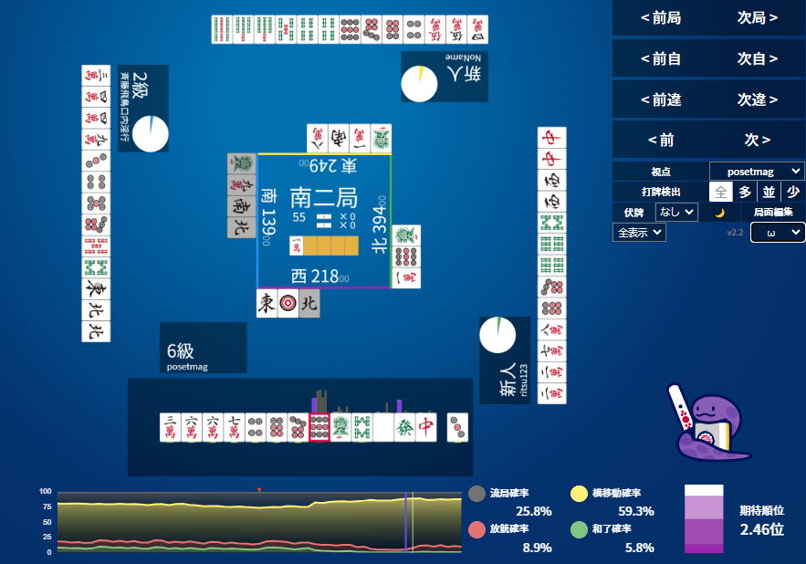
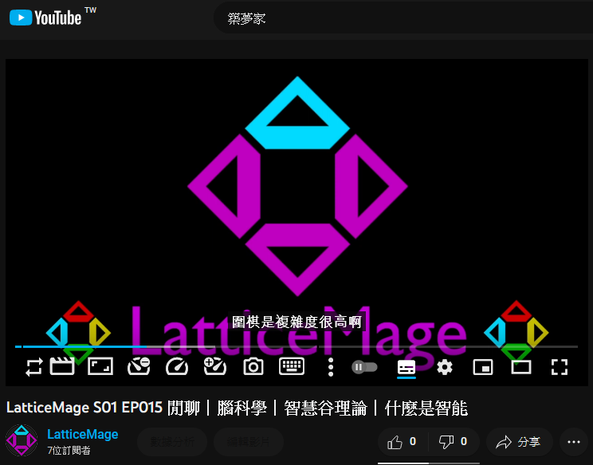

# 增肥v53 PosetMage - 用AI創造自己的工具組

## 標題

你應該用AI建立自己的工作流

因為只有你最知道你自己的需求

最後會有問卷請大家幫忙填你希望用AI解決什麼你的痛點

## 舉例md檔
其他筆記網站不好在不同地方sync  
而且這樣可以用不同軟體開啟 - foam vs obsidian  
vs  

## 架成資料網站

 

## 部落格、小說
 

## 不用被綁架
ex: hackmd網站更新無法使用舊版功能  
ex: discord是私人群組，而且內容不好備份  
  

## 遊戲發想提案
  

## 遊戲角色卡
  

## 遊戲劇本圖文

## 視覺化分析

## AI其他用法
* 看得懂TUI
* 可以寫各種mermaid語法，比如gantt圖、流程圖、樹狀圖
* 架設甚至製作各種工具
  * ex: 這個投影片模式
* 輔助打牌分析

katago圖片來自[katago专用对弈分析软件katrain – 天祺围棋](https://www.tianqiweiqi.com/katago-katrain.html)

## 上字幕

## 問卷連結

