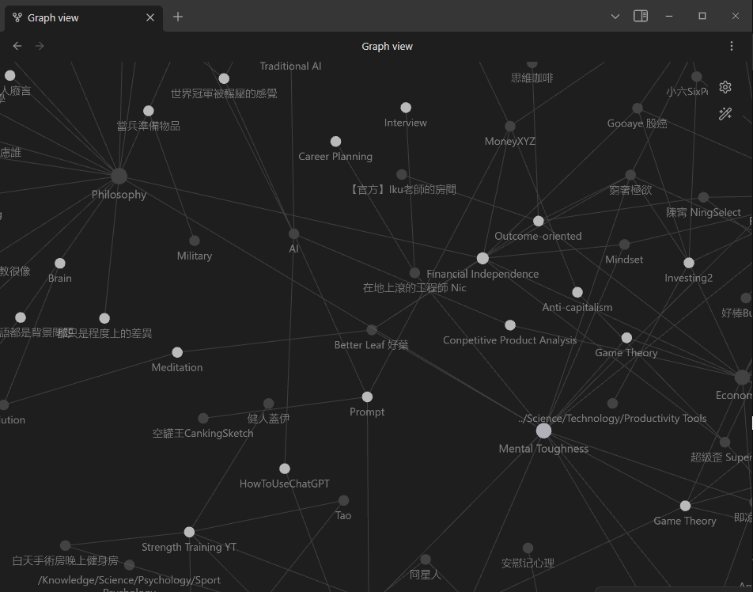
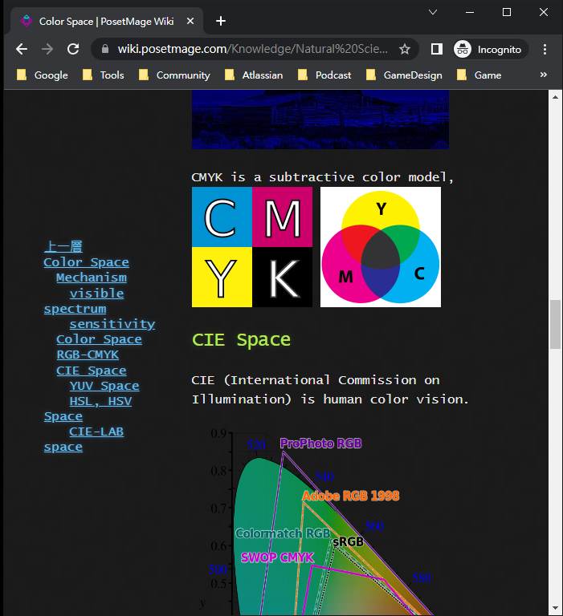
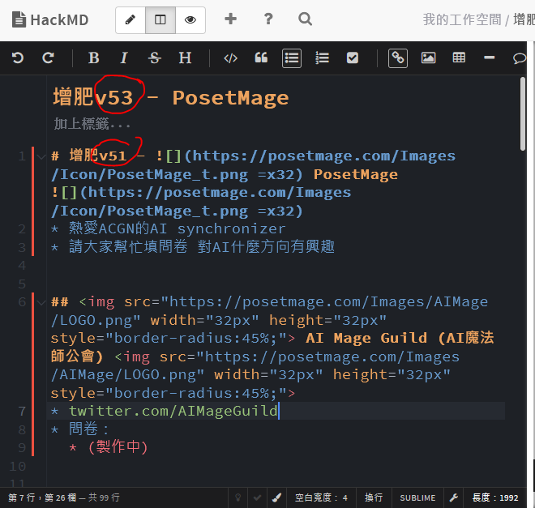
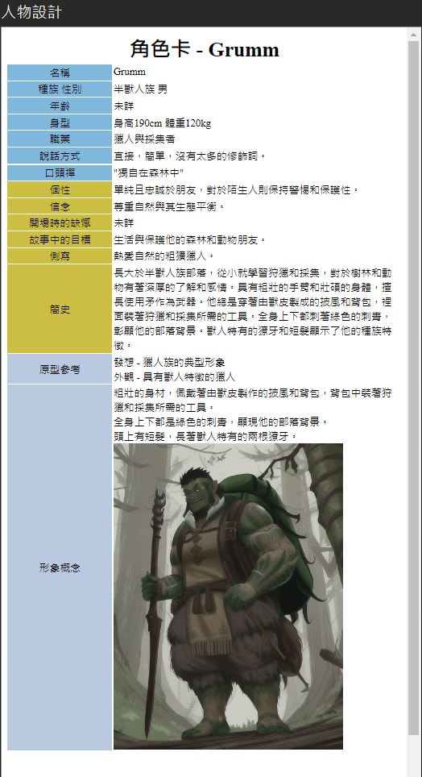
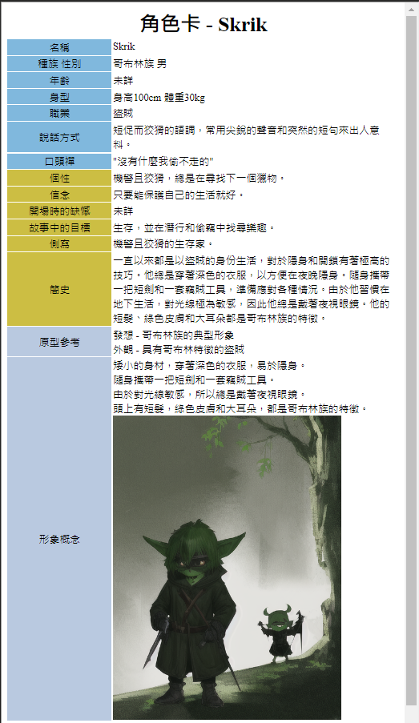

# 增肥v53 -  PosetMage  - AI創造自己的工具組

## 0. 標題

你應該用AI建立自己的工作流

因為只有你最知道你自己的需求

## 1. 舉例 我想要自有筆記檔案
這樣可以用不同軟體開啟 - foam or obsidian
  
vs  
  

## 2. 架成網站
  
  

## 3. 不用被綁架
ex: 網站操作方式更新  
  

ex: 其他筆記網站不好在不同地方sync  

ex: discord是私人群組，而且內容不好備份  
  

## 4. 遊戲設計-發想提案
  
  

## 5.角色卡
  

